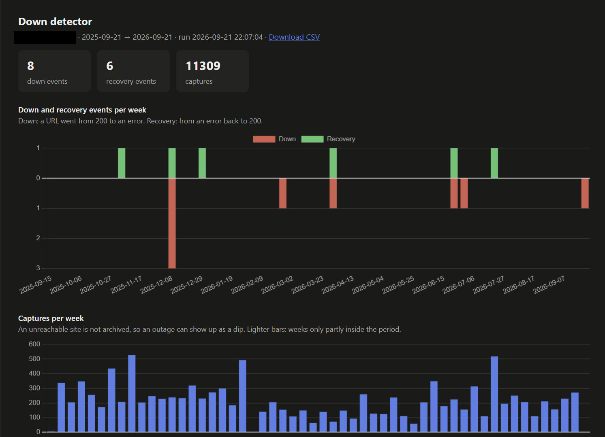
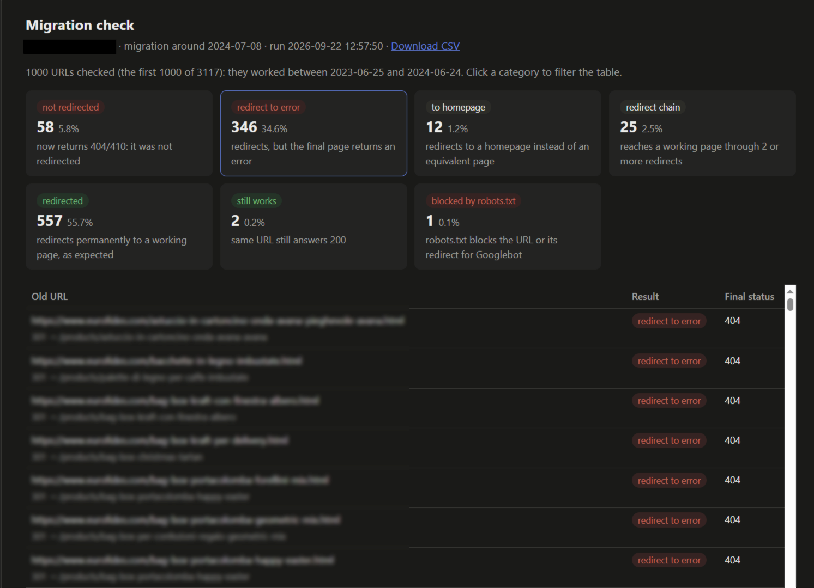
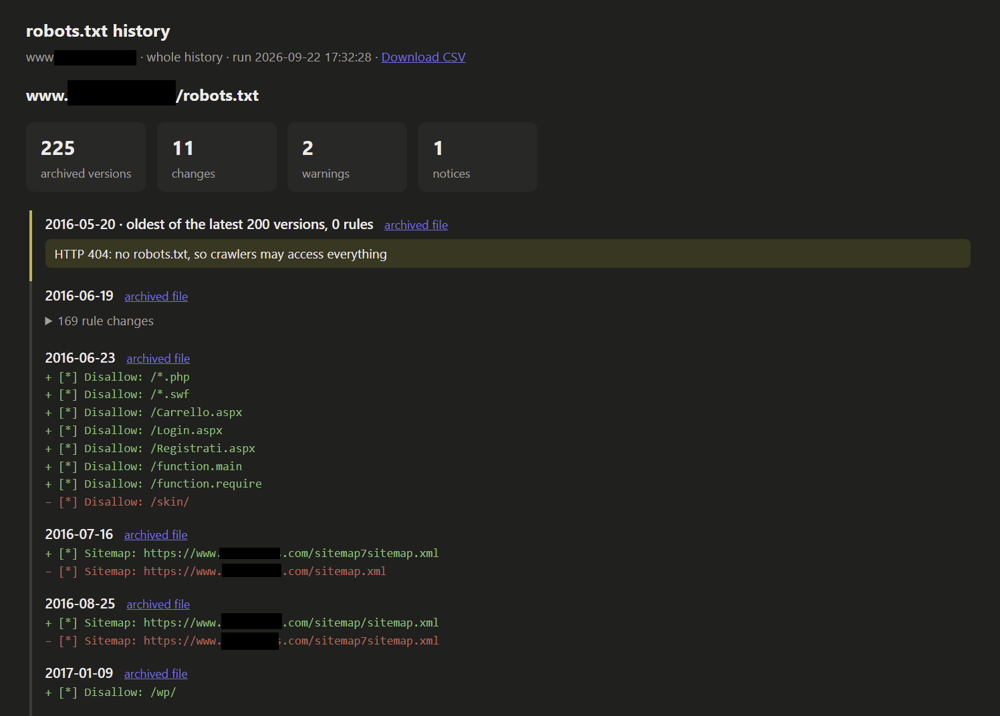

# Wayback SEO

Wayback SEO uses the Wayback Machine to look into a website's past. It has three tools: a down detector, a migration check and a robots.txt history. You can run them from the command line or from a web page.

## Install

Install uv, which also installs Python if it is missing. If you already have uv, skip this step.

- macOS and Linux: `curl -LsSf https://astral.sh/uv/install.sh | sh`
- Windows (PowerShell): `powershell -ExecutionPolicy ByPass -c "irm https://astral.sh/uv/install.ps1 | iex"`

Open a new terminal, then install Wayback SEO:

```
uv tool install https://github.com/LowLevel73/Wayback-SEO/archive/main.zip
```

To update Wayback SEO, run the same command with `--reinstall`.

## Uninstall

```
uv tool uninstall wayback-seo
```

Then delete the folder `~/.wayback-seo`, which holds the saved analyses, the cache and the settings.

## Web page

```
wayback-seo web
```

The page opens in your browser. It has a tab for each of the three tools, which work as described under [Command line](#command-line). The page adds these features:

- Every analysis is saved in the left column. Click it to open it again without downloading anything.
- **New analysis** empties the forms to start a new analysis.
- Each analysis has a **Download CSV** link.
- In the migration check, clicking a category filters the table to the URLs in that category.
- **Stop** ends a running analysis. It stops at the current request, and nothing is saved.

The page runs one analysis at a time.







## Command line

### Down detector

```
wayback-seo down --site www.example.com --from-date 2025-01-01 --to-date 2025-12-31
```

The down detector shows the weeks in which a site had errors. It saves a chart, `wayback_down.png`, that shows for each week how many URLs stopped working, how many started working again and how many pages the Wayback Machine archived. A week with far fewer archived pages than usual can also mean that the site was unreachable.

By default, every 4xx and 5xx status except 403 and 429 counts as an error. `--down-statuses 5xx` counts only server errors. `--csv FILE` saves the list of URLs that stopped or started working, with their dates.

### Migration check

```
wayback-seo migration --site www.example.com --date 2025-12-10
```

The migration check finds the URLs that stopped working after a migration. You give it the approximate date of the migration. It takes the URLs that worked in the months before that date, requests each one on the live site and sorts them into these categories:

| Category | Meaning |
|---|---|
| not redirected | Returns 404 or 410. |
| redirect to error | Redirects to a page that returns an error. |
| error | Returns another error status. |
| failed | Timeout, connection error or redirect loop. |
| to homepage | Redirects to the homepage. |
| temporary redirect | Reaches a working page through a 302, 303 or 307. |
| redirect chain | Reaches a working page through two or more redirects. |
| redirected | Redirects permanently to a working page. |
| still works | Returns 200. |

The check takes at most 1000 URLs; `--max-urls` changes that number. It also reports the URLs that robots.txt blocks for Googlebot. The results are saved in `migration_check.csv`.

The migration check sends requests to the analysed site, so use it only on sites you are allowed to audit.

### robots.txt history

```
wayback-seo robots --site www.example.com
```

The robots.txt history shows every change to a site's robots.txt over time, with the rules that each version added or removed. The last entry is the robots.txt online today, which the tool downloads from the site itself, so a change the archive has not captured yet is visible too.

It raises a warning when robots.txt:

- returns a 5xx or 429 status, which makes Google temporarily stop crawling;
- loses at least half of its rules at once;
- blocks the whole site for all crawlers.

It raises a notice when robots.txt:

- returns 404, 410 or another status that allows crawling of every URL;
- returns an HTML page;
- lifts a whole-site block.

The tool downloads the latest 200 archived versions; `--max-versions` changes that number.

The results are saved in `robots_history.csv`.

### Options

- `--site` takes a host (`www.example.com`), a section of a site (`www.example.com/shop/`) or a domain with its subdomains (`*.example.com`). You can give several values; the tool analyses them together.
- Dates can be written as `2025-12-10` or `20251210`.
- `--json FILE` saves the full result as JSON.
- `--verbose` prints every request.
- `--refresh` downloads the data again instead of using the cache, and `--no-cache` skips the cache.

`wayback-seo cache` shows the size of the cache and `wayback-seo cache --clear` empties it.

## Saved data

The tool saves its data in `~/.wayback-seo/`:

- `analyses/`: the analyses of the web page;
- `cache/`: the responses downloaded from the Wayback Machine;
- `config.toml`: the settings.

A request that was already made is answered from the cache, and the tool shows the date of the download. The cache keeps at most 100 MB and deletes the least recently used data first.

## Settings

The tool creates `~/.wayback-seo/config.toml` on its first run:

```toml
cache_limit_mb = 100         # maximum size of the cache, in MB
requests_per_minute = 30     # the Wayback Machine blocks clients that exceed 30
port = 8765                  # port of the web page
```

On the command line, the options `--cache-limit`, `--requests-per-minute` and `--port` override these settings for one run.

## Development

```
uv run pytest
```

## Limitations

- The Wayback Machine only has the pages its crawler captured. For rarely captured sites the results are incomplete.
- The archive's API is slow for very large sites.
- The tool reads robots.txt as Google does. Other search engines can interpret some rules differently.
- Antivirus software that inspects HTTPS traffic can refuse the tool's connections to the Wayback Machine.

## Credits

Wayback SEO relies on the [Wayback Machine](https://web.archive.org/) of the Internet Archive, which has been preserving the web since 1996 and makes its archive available to everyone. Thanks to the people who build and run it.

Wayback SEO was developed with the help of Claude Code, an AI coding assistant made by Anthropic.
